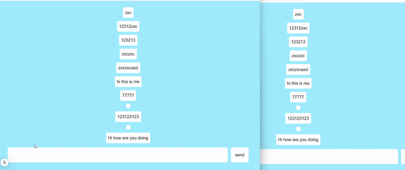

# Decent Chat
simple proof-of-concept on decentralized chat service.

## How it works 
When a client sends a message, it isn't routed through a centralized server. Instead, the message is sent directly to an Ethereum smart contract.

The browser periodically checks the smart contract for any updated chat data. If new messages are found, it retrieves and displays them.

This approach makes the browser as a simple intermediary between the client and the smart contract, ensuring that the application operates in a decentralized manner

### Demo 

